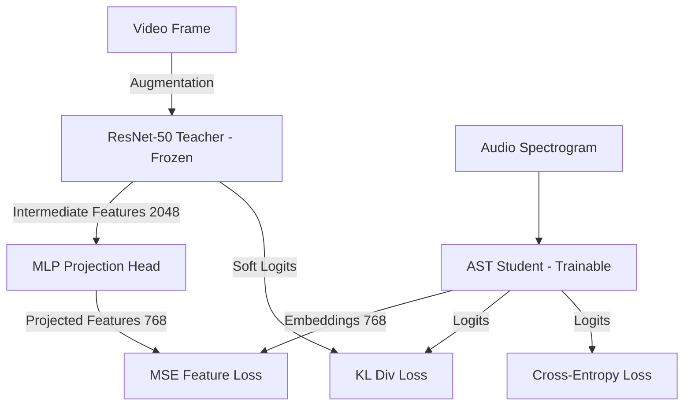

# Cross-Modal Knowledge Distillation (Audio → Vision) on VGGSound
- **Group ID**: Zero e Uno
- **Project ID**: Track 24

---

## 1. Introduction and Objective

Visual and audio streams in multimedia recordings carry complementary information, yet at inference time the visual channel is often unavailable or too expensive to process. This work studies modality hallucination through cross-modal Knowledge Distillation (KD). The goal is to transfer visual semantic knowledge from a frozen, pre-trained visual teacher (ResNet-50) into an audio-only student network (Audio Spectrogram Transformer, AST), so that the student can implicitly draw on visual context while consuming nothing but audio at deployment.

Our working hypothesis is that cross-modal supervision regularizes the audio representation and yields better generalization than a baseline trained with ordinary cross-entropy on audio labels alone. As the results show, the effect is real but narrow, and the ablation we report below is what makes its boundaries visible.

---

## 2. Contribution and Added Value

We implement a complete, end-to-end framework for cross-modal distillation on **VGGSound**. To align the two modalities we designed a two-layer MLP projection head ($2048 \to 512 \to 768$, with BatchNorm and ReLU) that maps the intermediate visual features of ResNet-50 into the Transformer embedding space of the AST, minimizing the Mean Squared Error (MSE) between the projected visual features and the audio patch embeddings. On top of this feature-level term we combine a soft Kullback–Leibler (KL) divergence loss with temperature scaling ($T=4.0$) and a standard Cross-Entropy (CE) loss with label smoothing ($0.1$).

We then run an ablation over the interpolation weight $\alpha \in \{0.3, 0.5, 0.7, 0.9\}$ to characterize the trade-off between fitting the ground-truth labels and imitating the teacher's soft distribution. Finally, because VGGSound is sourced from YouTube, we treat link rot as a first-class concern rather than a nuisance: we measure download success rates empirically so that both training and evaluation rest on an honest account of the data that is actually available.

---

## 3. Data Used

We work with a subset of **25 classes** from the VGGSound dataset, drawn from categories that originally provided a balanced setup of 1000 training clips and 50 test clips per class.

> **Exploratory Data Analysis.** The full dataset statistics, selection criteria, link-rot analysis, and modality inspections are documented in the accompanying interactive Jupyter notebooks:
> * **[01_dataset_exploration.ipynb](../notebooks/01_dataset_exploration.ipynb)**: full VGGSound exploration and the reasoning behind the 25-class selection.
> * **[02_downloaded_subset_exploration.ipynb](../notebooks/02_downloaded_subset_exploration.ipynb)**: theoretical subset balance, post-download link-rot success rates, and stratified splits.
> * **[03_audio_visual_inspection.ipynb](../notebooks/03_audio_visual_inspection.ipynb)**: mel-spectrogram extraction, waveforms, and visual-frame RGB statistics.

### Link-Rot and Real Dataset Statistics

YouTube link rot (removed videos, private channels) erodes the usable material. The final dataset comprises **20,672 valid clips**, a download success rate of 78.7%, amounting to roughly 6.6 GB of audio and 40 GB of video frames. The loss is not uniform across classes. The class *chicken crowing* was hit hardest, falling to 646 clips, which is $3.6\sigma$ below the mean ($\mu=826.88$, $\sigma=50.40$); the remaining classes stay tightly balanced, with success rates clustered between 75% and 84% (coefficient of variation 6.1%).

We partition the surviving data with stratification:
- **Train (85%)**: ~16,800 clips (~670 per class), used for optimization.
- **Validation (15%)**: ~3,000 clips (~119 per class), used for early stopping and hyperparameter tuning.
- **Test**: **933 blind clips** (~37 per class), held out strictly for the final evaluation.

### Preprocessing and Augmentation

On the audio side, clips are resampled to 16 kHz and converted to log-mel spectrograms ($N_{\text{fft}}=1024$, window length 400, hop length 160, $128$ mel bins), giving inputs of shape $(1, 128, 1024)$. On the video side, frames are normalized to ImageNet statistics and cropped to $(3, 224, 224)$; during training the teacher additionally sees RandomResizedCrop, RandomHorizontalFlip, and ColorJitter, while the audio student receives spectrograms without augmentation.

---

## 4. Methodology and Architecture

The pipeline comprises three models, summarized in the diagram below.

The teacher (EXP-002) is a ResNet-50 pre-trained on ImageNet, with its classification head replaced to predict 25 classes and fine-tuned with SGD on video frames by unfreezing layers 3, 4 and the FC head. The audio baseline (EXP-001) is an Audio Spectrogram Transformer initialized from ViT-B/16 weights, with $16 \times 16$ patches and position embeddings bilinearly interpolated to accept spectrogram inputs; it is trained from scratch with AdamW and cosine annealing.

The distilled student (EXP-003 to EXP-006) is the same AST, supervised jointly by the ground-truth labels and the frozen teacher through the total loss

$$\mathcal{L}_{\text{total}} = (1 - \alpha) \mathcal{L}_{\text{CE}} + \alpha T^2 \mathcal{L}_{\text{KL}} + \beta \mathcal{L}_{\text{MSE}}$$

with $T=4.0$, $\beta=0.3$, and $\alpha$ ablated. The teacher is kept frozen in `eval()` mode throughout, so no gradient ever flows back into the visual branch.

---

## 5. Results and Discussion

All models are evaluated on the blind test set of **933 samples**, using a persistent terminal run on `gnode10` (SLURM job 5157).

### Quantitative Comparison

**Table 1**: Quantitative results on the blind test set (AST & Teacher)

| Model ID | Model Description | Top-1 Val Acc | Top-1 Test Acc | Top-5 Test Acc | Model Size | Inference Latency |
| :--- | :--- | :---: | :---: | :---: | :---: | :---: |
| EXP-002 | ResNet-50 Teacher | 77.54% | 53.70% | 77.28% | 90.07 MB | 3.75 ms |
| EXP-001 | AST Audio Baseline | 88.43% | 66.35% | 85.42% | 326.80 MB | 5.13 ms |
| EXP-003 | Student KD ($\alpha=0.3$) | 88.37% | 65.59% | 87.67% | 326.80 MB | 5.10 ms |
| EXP-004 | Student KD ($\alpha=0.5$) | 88.91% | 66.88% | 87.78% | 326.80 MB | 5.11 ms |
| **EXP-005** | **Student KD ($\alpha=0.7$)** | **87.96%** | **66.99%** | **88.53%** | **326.80 MB** | **5.14 ms** |
| EXP-006 | Student KD ($\alpha=0.9$) | 86.57% | 63.02% | 87.89% | 326.80 MB | 5.14 ms |

### Analysis and Discussion

The best distilled AST (EXP-005, $\alpha=0.7$) reaches a Top-1 test accuracy of **66.99%**, a 0.64 point gain over the audio-only baseline (66.35%). This supports the hypothesis that cross-modal supervision can act as a useful regularizer and improve generalization on audio test data. The improvement is modest, and the ablation makes clear that it is also fragile.

A telling detail is the disagreement between the validation and test rankings. On validation, EXP-004 ($\alpha=0.5$, 88.91%) is the strongest distilled model, while on the blind test set EXP-005 ($\alpha=0.7$) takes the lead at 66.99%. We stress that the ablation is meant to *characterize* the behavior of $\alpha$ rather than to select a single deployed value: we report all four settings on both splits, and the robust conclusion is that validation and test agree on the same optimal region ($\alpha \in [0.5, 0.7]$), with both clearly beating the no-KD baseline and collapsing toward $\alpha=0.9$. The one-step disagreement on which endpoint of that region is best is consistent with statistical noise on 933 test samples; we report $\alpha=0.7$ as the test-set maximum while making the validation/test split explicit, rather than treating either number as a hidden selection criterion.

The effect of $\alpha$ follows a clear arc. At $\alpha=0.3$ the cross-entropy term dominates and the soft targets from a comparatively weak visual teacher behave more like noise than regularization, pulling the student slightly below baseline (65.59%, $-0.76\%$). At $\alpha=0.5$ and $\alpha=0.7$ the soft targets become a net benefit, with $\alpha=0.7$ giving the best test accuracy ($+0.64\%$). At $\alpha=0.9$ the picture reverses sharply ($-3.33\%$): the KL term now forces the student to over-imitate the teacher's distribution, and because that teacher is only 53.70% accurate, the imitation actively hinders acoustic generalization.

Two further observations round out the picture. First, the feature-alignment MSE falls steadily from $\approx 0.15$ at epoch 1 to below $0.002$ by epoch 15 across all distilled runs, confirming that the projection head ($2048 \to 512 \to 768$) does succeed in bridging the visual and audio embedding spaces. Second, the audio baseline (66.35%) outperforms the visual teacher (53.70%) by 12.65 points, a reminder that for labels such as *ambulance siren*, *toilet flushing*, or *playing flute* the acoustic signal is intrinsically the more discriminative one.

### Success Criteria Verification

| Criterion | Target | Result | Status |
| :--- | :--- | :--- | :---: |
| Teacher accuracy (Top-1) | ≥ 50% | 53.70% | Met |
| Audio baseline accuracy | Lower bound reference | 66.35% | Met |
| Distilled student accuracy | > Audio baseline | 66.99% (EXP-005, $\alpha=0.7$) | Met |
| Optimal $\alpha$ identification | Identify best ablation value | $\alpha=0.7$ (test), $\alpha=0.5$ (val) | Met |
| Student model size | < Teacher size | 326.80 MB > 90.07 MB | Not met |
| Student inference latency | < Teacher latency | 5.10 ms > 3.75 ms | Not met |

The two unmet criteria deserve a word of context. The AST (ViT-B/16) is architecturally larger than ResNet-50 by design: it is a high-accuracy Transformer for audio classification, not a compression target. The student's operational advantage lies in its modality (audio-only at inference, with no video required) and in its higher accuracy ($+13.29$ points over the teacher on test), not in compactness. The size and latency constraints are addressed head-on by the lightweight CNN benchmark in Section 7.

---

## 6. Conclusion and Limitations

### Summary

Cross-modal knowledge distillation does improve audio-only classification, though within tight margins. The best distilled AST (EXP-005, $\alpha=0.7$) reaches 66.99% test accuracy ($+0.64\%$ over baseline), and MobileNetV3-Small benefits from the same regularizing pressure ($+0.22\%$). In both cases the visual teacher's dark knowledge behaves as a structured regularizer for the audio student's representation space, but the size of the benefit is bounded by how much that teacher actually knows.

### Structural Limitations of the Visual Teacher

Three properties of the visual modality explain the ResNet-50 teacher's low accuracy (53.70%) and cap the ceiling of any cross-modal distillation built on top of it.

The first is that VGGSound is audio-centric, so the visual signal is only weakly aligned with the label. The dataset was assembled from videos where the acoustic signal is the primary semantic cue, and the frames tend to capture background context rather than the sounding source. For the class *ambulance siren*, for instance, the frame is more likely to show a dark street, blurred headlights, or a vehicle interior than a clearly visible ambulance: the siren waveform is unambiguous, but the frame is largely incidental visual noise. This is a property of the dataset by design, not a fault of the teacher architecture.

The second is the use of a single static frame. To limit compute and VRAM on the DMI cluster, the visual dataloader extracts one central frame from each 10-second clip, which discards all temporal information. Classes with a strong temporal signature pay the highest price: *toilet flushing* and *crying baby* have unmistakable acoustic time-series, but their central frames (a static toilet bowl, or a newborn who might simply be yawning) are visually ambiguous without motion. Lifting this bottleneck would require processing multiple frames with a 3D CNN or a Video Transformer, as sketched in the Extra Objective 2 extension.

The third is inter-class visual similarity within the 25-class subset. The subset includes *playing flute*, *playing violin*, *playing cello*, and *playing clarinet*, instruments whose timbres and fundamental frequencies are immediately separable by ear. Visually, however, their central frames are nearly interchangeable: a seated musician in the foreground, a blurred domestic or theatrical background, similar hand postures and body positions. ResNet-50 cannot resolve such fine instrument detail from a single compressed frame, whereas the AST and EfficientNet-B0 settle the class from the fundamental frequency alone.

### Computational Limitations

The AST student (326.80 MB, 5.14 ms) is larger and slower than the ResNet-50 teacher (90.07 MB, 3.75 ms). As noted above, its advantage is modality and accuracy rather than footprint. We address the footprint directly in the lightweight CNN benchmark of Section 7: EfficientNet-B0 reaches 69.77% accuracy at 21× lower memory (15.57 MB, 2.48 ms), and MobileNetV3-Small reaches 62.06% KD accuracy at 90× lower memory (3.64 MB, 1.56 ms).

---

## 7. Extra Objective: Lightweight CNN Student Benchmark

To confront the size and latency cost of the Audio Spectrogram Transformer (326.80 MB), we evaluated two lightweight CNN student architectures from `torchvision`: **EfficientNet-B0** and **MobileNetV3-Small**. Both were trained on mel-spectrograms under two regimes: as pure baselines (Cross-Entropy only) and as distilled students (cross-modal KD with $\alpha=0.3$ and temperature $T=4.0$ from the ResNet-50 teacher).

> **Note on the $\alpha$ choice for CNN students.** The systematic ablation over $\alpha \in \{0.3, 0.5, 0.7, 0.9\}$ was run only on the main student (AST, 326.80 MB, 85.6M parameters). For the lightweight benchmark we fixed $\alpha=0.3$ as a conservative setting, on the reasoning that networks with up to 90× fewer parameters than the AST have far less capacity to absorb complex soft distributions from an already weak teacher (53.70%). The results bear this out: EfficientNet-B0 at $\alpha=0.3$ already regresses on Top-1 relative to its pure baseline (66.77% vs 69.77%), which strongly suggests that larger $\alpha$ values would have hurt these smaller architectures even more.

### Quantitative Results

The results on the blind test set (EXP-007 to EXP-010) are collected in Table 2.

**Table 2**: Lightweight CNN Benchmark Results vs AST & Teacher

| Model ID | Model Description | Top-1 Test Acc | Top-5 Test Acc | Model Size | Inference Latency |
| :--- | :--- | :---: | :---: | :---: | :---: |
| EXP-002 | ResNet-50 Teacher | 53.70% | 77.28% | 90.07 MB | 3.75 ms |
| EXP-001 | AST Audio Baseline | 66.35% | 85.42% | 326.80 MB | 5.13 ms |
| EXP-009 | EfficientNet-B0 Baseline | **69.77%** | 90.14% | 15.57 MB | 2.48 ms |
| EXP-007 | EfficientNet-B0 KD ($\alpha=0.3$) | 66.77% | **92.93%** | 15.57 MB | 2.46 ms |
| EXP-010 | MobileNetV3-Small Baseline | 61.84% | 88.42% | 3.64 MB | 1.57 ms |
| EXP-008 | MobileNetV3-Small KD ($\alpha=0.3$) | 62.06% | 89.07% | 3.64 MB | 1.56 ms |

### Analysis and Discussion

Both lightweight students cut resources sharply. EfficientNet-B0 reduces model size by 21× (from 326.80 MB to 15.57 MB) and roughly halves inference latency (from 5.13 ms to 2.46 ms). MobileNetV3-Small goes further still, with a 90× size reduction (3.64 MB) and latency more than three times lower (1.56 ms), which makes it a realistic candidate for resource-constrained edge deployment.

The accuracy story is more nuanced. The EfficientNet-B0 baseline (EXP-009) is in fact the most accurate model in the entire study, at 69.77% Top-1, 3.42 points above the heavy AST baseline. This points to the local, translation-equivariant inductive bias of a CNN being well matched to the banded structure of mel-spectrograms at this dataset scale. Distillation does not help it: EXP-007 lowers Top-1 to 66.77% but pushes Top-5 to a project-high 92.93% ($+2.79$). For MobileNetV3-Small the distillation signal is mildly positive, lifting Top-1 from 61.84% to 62.06% ($+0.22$) and Top-5 from 88.42% to 89.07% ($+0.65$). Taken together, the pattern is consistent with the $\alpha$ ablation on the AST: a weak teacher helps only at the margins, and only for the smallest student.

---

## 8. Additional Information

### 8.1 Contribution Breakdown

**Denise Cilia** implemented the wrapper for the Audio Spectrogram Transformer and the training pipeline for the audio baseline (`train_baseline_audio.py`), and managed the hyperparameter tuning and configuration templates (`common.yaml`, `baseline_audio.yaml`). She ran the full suite of $\alpha$ ablation experiments (EXP-003 to EXP-006) on the DMI cluster, computing and optimizing the convergence curves. For the Extra Objective 3 benchmark she trained and evaluated both lightweight CNN students (EfficientNet-B0 and MobileNetV3-Small) in baseline and KD configurations (EXP-007 to EXP-010) and carried out their final evaluation. She co-developed the modality-inspection notebook (`03_audio_visual_inspection.ipynb`) and the post-download link-rot notebook (`02_downloaded_subset_exploration.ipynb`). On the presentation side she co-designed the high-contrast Daylight Retro theme of `presentation.html`, updated the plotting scripts (`comparison.py`) to produce white-background, dark-text figures for projector legibility, and generated the comparative figures.

**Eleonora Giuffrida** structured the core utilities (TensorBoard/W&B logger, early stopping) and the local-to-cluster synchronization scripts (`sync_to_cluster.sh`), and developed the multi-modal `VGGSoundDataset` loader with its handling of YouTube link rot. She developed and fine-tuned the `VisionTeacher` network (ResNet-50, EXP-002), including the offline ImageNet-weights fallback and the selective layer-freezing strategy, and designed the distillation losses (temperature-scaled soft KL divergence and MSE feature alignment via the two-layer MLP projection head $2048 \to 512 \to 768$). For Extra Objective 3 she adapted the EfficientNet-B0 and MobileNetV3-Small backbones to accept single-channel mel-spectrogram inputs. She also ran the initial descriptive analysis of the full VGGSound dataset, co-developed the selection-rationale notebook (`01_dataset_exploration.ipynb`), and co-developed the final presentation slides.

### 8.2 Use of Artificial Intelligence

We used AI coding assistants (both *Gemini 3.5 High* & *Claude Sonnet 4.6*) to accelerate boilerplate (data-augmentation loops, model-logging integrations), to standardize the YAML `extends` logic and the multi-run automation scripts, and to format LaTeX equations and Markdown tables. All architectural decisions, mathematical formulations, and evaluation analyses were independently verified by the authors.
Slides were generated using ([Frontend Slides](https://github.com/zarazhangrui/frontend-slides)) which is distributed under the [MIT License](https://github.com/zarazhangrui/frontend-slides/blob/main/LICENSE). The final PDF slides are available in the `docs/` directory. Template and style were adjusted to match the group's aesthetic preference and readability.